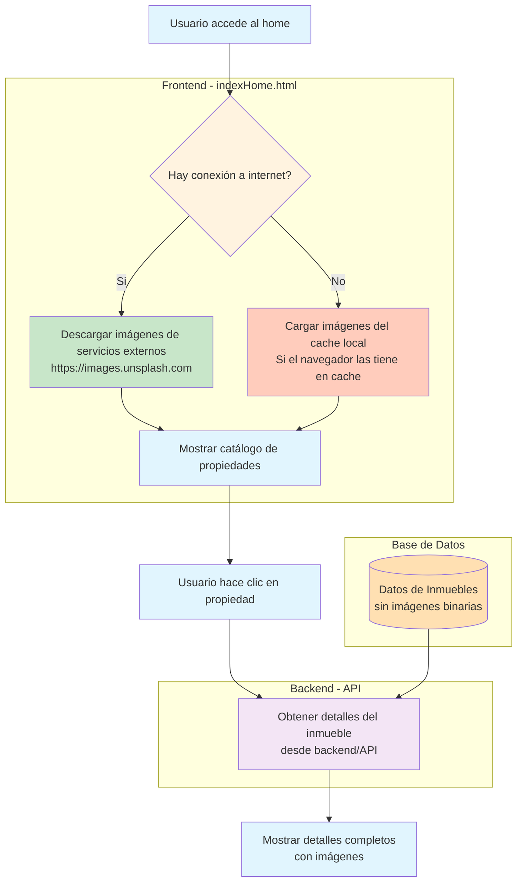

# Flujo de Datos en el Catálogo de Propiedades

## Diagrama de Flujo

## Explicación del Manejo de Imágenes

### En la Base de Datos
La tabla `inmueble` no almacena imágenes directamente. Según el modelo de dominio, las imágenes se manejan en una tabla separada y se relacionan con los inmuebles mediante la clase [Inmueble](file:///home/sebas_jsdv/IdeaProjects/inmobiliariaSoft3Back2.0/product-demoLogin/src/main/java/com/jsebastian/eden/EdenSys/domain/Inmueble.java#L13-L66) que contiene una lista de objetos [Imagen](file:///home/sebas_jsdv/IdeaProjects/inmobiliariaSoft3Back2.0/product-demoLogin/src/main/java/com/jsebastian/eden/EdenSys/domain/Imagen.java#L6-L18).

### En el Frontend (indexHome.html)
Las imágenes en la página de inicio se cargan desde URLs externas de Unsplash:
- https://images.unsplash.com/photo-1568605114967-8130f3a36994
- https://images.unsplash.com/photo-1512917774080-9991f1c4c750
- https://images.unsplash.com/photo-1580587771525-78b9dba3b914

Estas imágenes se muestran directamente en las tarjetas de propiedades sin necesidad de pasar por el backend.

### Acerca del funcionamiento sin internet
El indexHome.html **necesita conexión a internet** para mostrar las imágenes actuales, ya que se cargan desde servicios externos (Unsplash). Sin embargo, si el navegador ya ha cargado estas imágenes previamente, el navegador puede mostrarlas desde su caché local incluso sin conexión.

Para una verdadera experiencia offline, se deberían:
1. Almacenar las imágenes localmente en el servidor
2. Usar rutas relativas en lugar de URLs externas
3. Implementar Service Workers para cachear recursos